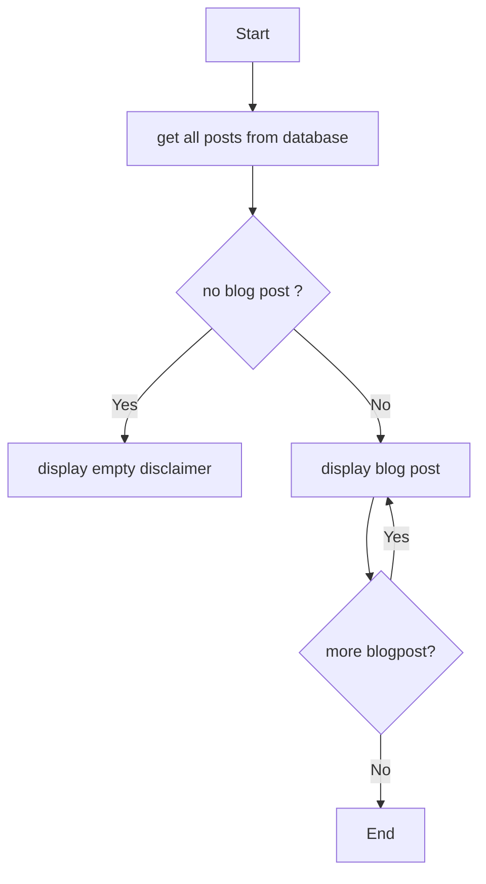
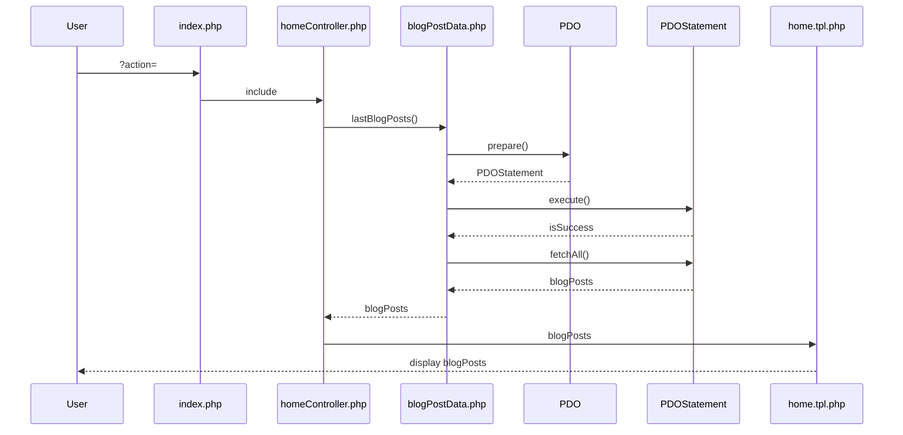
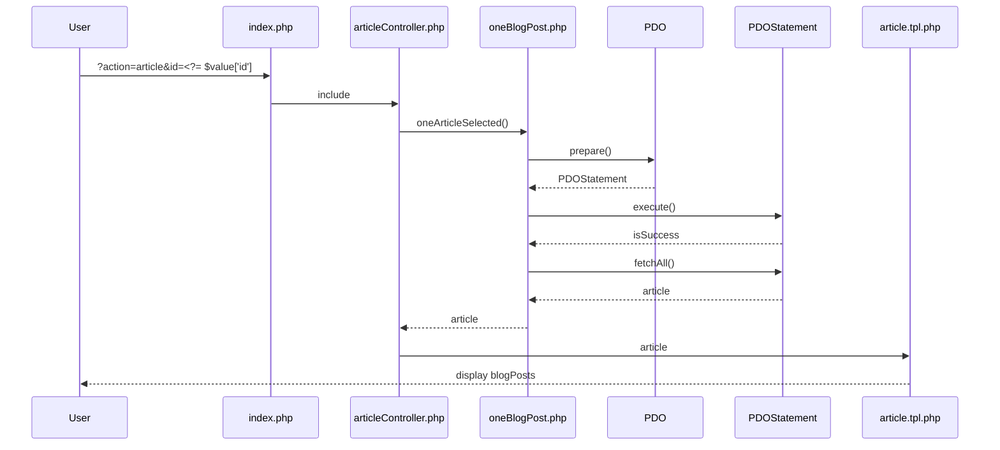

```mermaid
graph TD
A[Start] --> B[get all posts from database]
B --> C{no blog post ?}
C -- Yes --> D[display empty disclaimer]
C -- No --> E[display blog post]
E --> F{more blogpost?}
F -- Yes --> E
F -- No --> G[End]
```
affichage sélection blog de la page d'accueil 

```mermaid
sequenceDiagram
User->>index.php: ?action=
index.php->>homeController.php: include
homeController.php->>blogPostData.php: lastBlogPosts()
blogPostData.php->>PDO: prepare()
PDO-->>blogPostData.php: PDOStatement
blogPostData.php->>PDOStatement: execute()
PDOStatement-->>blogPostData.php: isSuccess
blogPostData.php->>PDOStatement: fetchAll()
PDOStatement-->>blogPostData.php: blogPosts
blogPostData.php-->>homeController.php: blogPosts
homeController.php->>home.tpl.php: blogPosts
home.tpl.php-->>User: display blogPosts
```
affichage d'un article

```mermaid
sequenceDiagram
User->>index.php: ?action=article&id=<?= $value['id']
index.php->>articleController.php: include
articleController.php->>oneBlogPost.php: oneArticleSelected()
oneBlogPost.php->>PDO: prepare()
PDO-->>oneBlogPost.php: PDOStatement
oneBlogPost.php->>PDOStatement: execute()
PDOStatement-->>oneBlogPost.php: isSuccess
oneBlogPost.php->>PDOStatement: fetchAll()
PDOStatement-->>oneBlogPost.php: article
oneBlogPost.php-->>articleController.php: article
articleController.php->>article.tpl.php: article
article.tpl.php-->>User: display blogPosts
```

